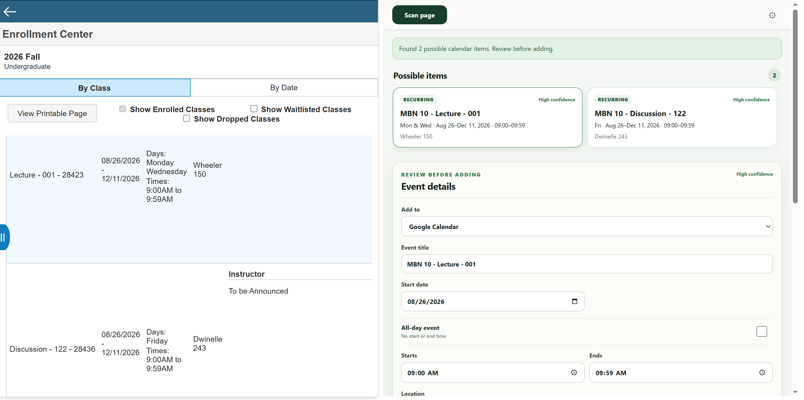
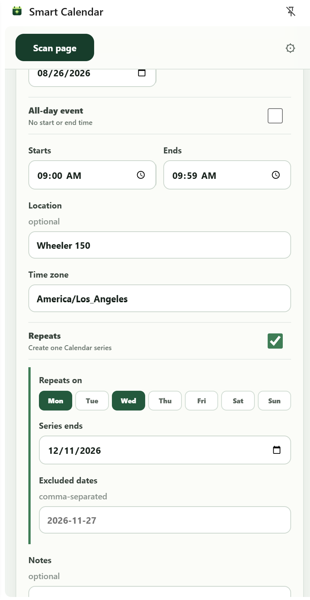
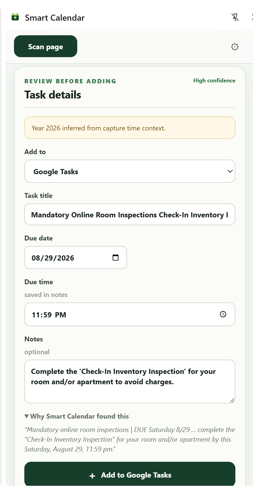
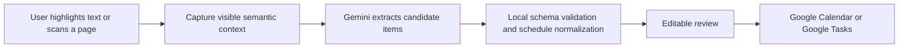

# Smart Calendar

Smart Calendar is an AI-assisted Chrome extension that turns dates and schedules on webpages into reviewed Google Calendar events or Google Tasks.

Highlight an appointment in an email, scan a workplace schedule, capture a conference session, or import an entire class timetable. Smart Calendar combines the selected or visible page text with its surrounding headings, table structure, page title, URL, capture time, and browser timezone to reconstruct useful calendar details. Nothing is created until the user reviews and approves it.

## What it can do

- Highlight text on a webpage, right-click, and choose **Add to Calendar**.
- Scan the visible page for multiple possible events and deadlines.
- Recognize meetings, appointments, reservations, performances, exams, and other one-time events.
- Convert explicit weekday schedules with bounded date ranges into one recurring Calendar series.
- Detect assignments, homework, projects, applications, and deadlines as Google Tasks.
- Keep separately dated items (like exams) separate from a recurring schedule.
- Review and edit the destination, title, date, time, timezone, location, notes, recurrence, and exclusions before adding anything.
- Preserve source links and unsupported Google Tasks due times in notes.
- Warn about ambiguous extraction and items previously added by the extension.

## Screenshots

| Scan results | Event review | Task review |
| --- | --- | --- |
|  |  |  |

## How it works



The extraction layer is provider-neutral. The current `GeminiCloudExtractor` uses the user’s own Gemini API key and `gemini-3.5-flash-lite`. Gemini responses are validated locally before reaching the review UI. Explicit date ranges and weekdays receive an additional deterministic recurrence check so a schedule cannot silently become one months-long event.

The extension has no backend. Page capture is user-triggered. It declares HTTPS host access so scanning works reliably across normal secure websites, but it never scans pages automatically or in the background.

## Technology

- Chrome Manifest V3, Side Panel, Context Menus, Identity, and Scripting APIs
- TypeScript, React, and WXT
- Gemini Interactions API
- Google Calendar API and Google Tasks API
- Vitest with fixed extraction fixtures and optional live Gemini contract testing

## Prerequisites

- Desktop Chrome 116 or newer
- Node.js and pnpm
- A Gemini API key from [Google AI Studio](https://aistudio.google.com/app/apikey)
- A Google Cloud project with the Google Calendar API and Google Tasks API enabled
- A Chrome Extension OAuth client configured for development extension ID `jmhidpgbkdfdabfclmmodellelanfcfk`

## Google OAuth setup

1. Create or select a project in Google Cloud Console.
2. Enable **Google Calendar API** and **Google Tasks API**.
3. Configure **Google Auth Platform → Branding**, **Audience**, and **Data Access**.
4. Add these scopes:

   - `https://www.googleapis.com/auth/calendar.events.owned`
   - `https://www.googleapis.com/auth/tasks`

5. While the OAuth app is in Testing mode, add every account that will use it under **Audience → Test users**.
6. Create an OAuth client with application type **Chrome Extension**.
7. Set its extension ID to `jmhidpgbkdfdabfclmmodellelanfcfk`.
8. Copy `.env.example` to `.env.local` and add the OAuth client ID:

   ```dotenv
   WXT_GOOGLE_OAUTH_CLIENT_ID=123456789-example.apps.googleusercontent.com
   ```

The committed manifest key is a public key that keeps the unpacked development extension ID stable. OAuth client IDs are also public identifiers. 

Public distribution requires a production OAuth configuration and Google verification where applicable. Friends can instead create their own Google Cloud project and local OAuth client by following the steps above.

## Install and run

```powershell
pnpm install
pnpm test
pnpm typecheck
pnpm build
```

Then:

1. Open `chrome://extensions`.
2. Enable **Developer mode**.
3. Select **Load unpacked** and choose `.output/chrome-mv3`.
4. Open Smart Calendar’s settings, enter a Gemini API key, and choose **Test & save**.
5. Scan a webpage or highlight text and use the context-menu action.

For live development, run `pnpm dev` and load `.output/chrome-mv3-dev` if WXT does not open it automatically.

## Commands

| Command | Purpose |
| --- | --- |
| `pnpm dev` | Start WXT development mode with live reload. |
| `pnpm test` | Run deterministic unit and fixture tests. |
| `pnpm test:watch` | Run tests in watch mode. |
| `pnpm typecheck` | Run strict TypeScript checks. |
| `pnpm build` | Build the unpacked production extension. |
| `pnpm zip` | Create a Chrome Web Store upload archive. |
| `pnpm probe:gemini` | Compare live Gemini request formats outside Chrome. |

The live Gemini probe reads `GEMINI_API_KEY` and optional `GEMINI_MODEL` values only from the current shell environment. It prints Google’s responses with the key redacted and does not write either value to disk.

## Privacy and security

- Scanning occurs only after a user gesture, despite the broad HTTPS host permission needed for reliable page injection.
- Hidden text, scripts, and form values are not intentionally captured.
- Gemini keys are stored in unsynchronized `chrome.storage.local` and are never bundled into builds.
- Chrome manages Google OAuth tokens; the extension does not persist them itself.
- Captured text goes directly to Gemini, and reviewed items go directly to the relevant Google API.
- No developer-operated server receives page content, keys, tokens, events, or tasks.

See [PRIVACY.md](./PRIVACY.md) for the complete disclosure.

## Current limitations

- English-language extraction only.
- Chrome-protected pages cannot be scanned.
- Authenticated pages are interpreted from captured visible text; Gemini cannot independently open their private URLs.
- Google Tasks stores a due date but discards due times, so Smart Calendar preserves due times in task notes.
- Duplicate detection currently uses the extension’s local creation history rather than searching the user’s Google account.
- Recurring exclusions are included only when explicitly stated or entered during review; academic holidays are never guessed.
